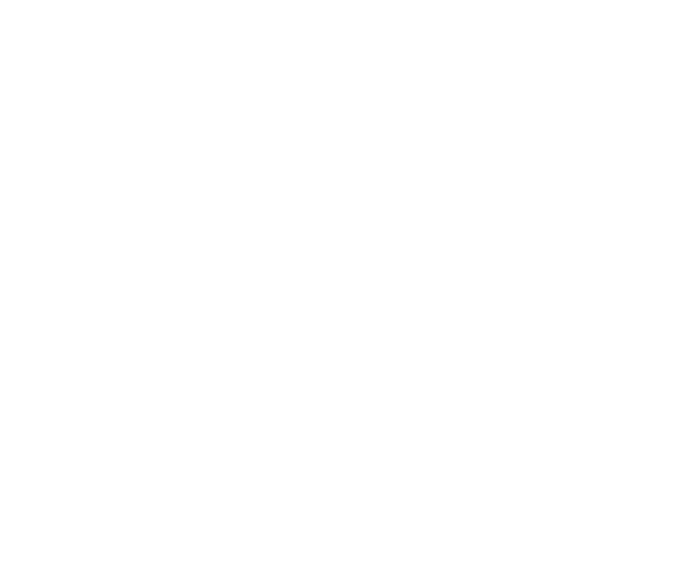

[![Contributors][contributors-shield]][contributors-url]
[![Forks][forks-shield]][forks-url]
[![Stargazers][stars-shield]][stars-url]
[![Issues][issues-shield]][issues-url]
[![MIT License][license-shield]][license-url]
[![LinkedIn][linkedin-shield]][linkedin-url]


<!-- PROJECT LOGO -->
<br />
<div align="center">
  <a href="https://github.com/veryshyjelly/gRMS">
    
  </a>

<h3 align="center"><b>gRMS</b></h3>

  <p align="center">
    gRMS is a fully fledged messaging service written in golang
    <br />
    <a href="https://github.com/veryshyjelly/gRMS"><strong>Explore the docs »</strong></a>
    <br />
    <br />
    <a href="https://github.com/veryshyjelly/gRMS">View Demo</a>
    ·
    <a href="https://github.com/veryshyjelly/gRMS/issues">Report Bug</a>
    ·
    <a href="https://github.com/veryshyjelly/gRMS/issues">Request Feature</a>
  </p>
</div>


<!-- TABLE OF CONTENTS -->
<details>
  <summary>Table of Contents</summary>
  <ol>
    <li>
      <a href="#about-the-project">About The Project</a>
    </li>
    <li>
      <a href="#getting-started">Getting Started</a>
      <ul>
        <li><a href="#prerequisites">Prerequisites</a></li>
        <li><a href="#installation">Installation</a></li>
      </ul>
    </li>
    <li><a href="#usage">Usage</a></li>
    <li><a href="#roadmap">Roadmap</a></li>
    <li><a href="#contributing">Contributing</a></li>
    <li><a href="#license">License</a></li>
    <li><a href="#contact">Contact</a></li>
    <li><a href="#acknowledgments">Acknowledgments</a></li>
  </ol>
</details>


<!-- ABOUT THE PROJECT -->
## About The Project

gRMS is a fully fledged messaging service written completely in golang, with the help of Go-Fiber and mySQL

<p align="right">(<a href="#readme-top">back to top</a>)</p>


<!-- GETTING STARTED -->
## Getting Started

This is an example of how you may give instructions on setting up your project locally.
To get a local copy up and running follow these simple example steps.

### Prerequisites

* Go
  ```sh
  sudo apt install golang
  ```

### Installation

1. Get your local IP address
    ```sh
    ip address
     ```
2. Clone the repo
   ```sh
   git clone https://github.com/veryshyjelly/gRMS.git
   ```
3. Build the project
   ```sh
   go build
   ```
4. Run the project
    ```sh
    ./gRMS
    ```

<p align="right">(<a href="#readme-top">back to top</a>)</p>


<!-- USAGE EXAMPLES -->
## Usage

This app can be used to host a messaging service on you local network, as well as on the cloud.
Just run the server and enter the ip address in the client and get hooked-up.

_For more examples, please refer to the [Documentation](https://example.com)_

<p align="right">(<a href="#readme-top">back to top</a>)</p>


<!-- ROADMAP -->
## Roadmap

- JWT authentication for saving sessions
- P2P file transfer
- Get history of selected chat
    - specify the number of messages

See the [open issues](https://github.com/veryshyjelly/gRMS/issues) for a full list of proposed features (and known issues).

<p align="right">(<a href="#readme-top">back to top</a>)</p>


<!-- CONTRIBUTING -->
## Contributing

Contributions are what make the open source community such an amazing place to learn, inspire, and create. Any contributions you make are **greatly appreciated**.

If you have a suggestion that would make this better, please fork the repo and create a pull request. You can also simply open an issue with the tag "enhancement".
Don't forget to give the project a star! Thanks again!

1. Fork the Project
2. Create your Feature Branch (`git checkout -b feature/AmazingFeature`)
3. Commit your Changes (`git commit -m 'Add some AmazingFeature'`)
4. Push to the Branch (`git push origin feature/AmazingFeature`)
5. Open a Pull Request

<p align="right">(<a href="#readme-top">back to top</a>)</p>


<!-- LICENSE -->
## License

Distributed under the MIT License. See `LICENSE.txt` for more information.

<p align="right">(<a href="#readme-top">back to top</a>)</p>


<!-- CONTACT -->
## Contact

Ayush Biswas - [@veryshyjelly](https://twitter.com/veryshyjelly) - veryshyjelly@gmail.com

Project Link: [https://github.com/veryshyjelly/gRMS](https://github.com/veryshyjelly/gRMS)

<p align="right">(<a href="#readme-top">back to top</a>)</p>


<!-- ACKNOWLEDGMENTS -->
## Acknowledgments

* [Go-React-Chat-App](https://github.com/AkhilSharma90/GO-React-Fullstack-Chat)

<p align="right">(<a href="#readme-top">back to top</a>)</p>


<!-- MARKDOWN LINKS & IMAGES -->
<!-- https://www.markdownguide.org/basic-syntax/#reference-style-links -->
[contributors-shield]: https://img.shields.io/github/contributors/veryshyjelly/gRMS.svg?style=for-the-badge
[contributors-url]: https://github.com/veryshyjelly/gRMS/graphs/contributors
[forks-shield]: https://img.shields.io/github/forks/veryshyjelly/gRMS.svg?style=for-the-badge
[forks-url]: https://github.com/veryshyjelly/gRMS/network/members
[stars-shield]: https://img.shields.io/github/stars/veryshyjelly/gRMS.svg?style=for-the-badge
[stars-url]: https://github.com/veryshyjelly/gRMS/stargazers
[issues-shield]: https://img.shields.io/github/issues/veryshyjelly/gRMS.svg?style=for-the-badge
[issues-url]: https://github.com/veryshyjelly/gRMS/issues
[license-shield]: https://img.shields.io/github/license/veryshyjelly/gRMS.svg?style=for-the-badge
[license-url]: https://github.com/veryshyjelly/gRMS/blob/master/LICENSE.txt
[linkedin-shield]: https://img.shields.io/badge/-LinkedIn-black.svg?style=for-the-badge&logo=linkedin&colorB=555
[linkedin-url]: https://linkedin.com/in/veryshyjelly
[Go]: https://img.shields.io/badge/Golang-878787?style=for-the-badge&logo=go&logoColor=white
[Go-link]: https://golang.google.cn/
[Go-fiber]: https://img.shields.io/badge/%F0%9F%92%A1%20Go-Fiber-00ACD7.svg?style=flat-square
[Fiber-url]: https://github.com/gofiber/fiber